# BUTCH GRAVES 3D — Night of the Pumpkin King

<p align="center">
  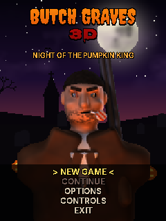
  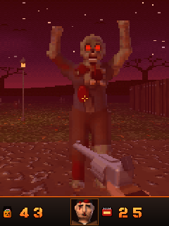
  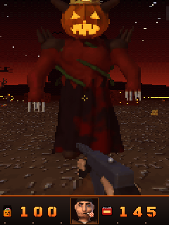
</p>

A Duke Nukem 3D–style Halloween shooter for J2ME phones (MIDP 2.0 / CLDC 1.0).

Hollow Creek, October 31st. The Harvest Cult has woken the **Pumpkin King**, and the dead are
climbing out of Butch Graves' cemetery. Butch is the town gravedigger, and he is done being polite.

## Screenshots

*Real captures at 240x320, running in a J2ME emulator.*

<table>
  <tr>
    <td align="center"><br><sub>Title screen</sub></td>
    <td align="center">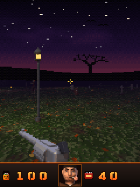<br><sub>Night 1: Dead End Cemetery</sub></td>
    <td align="center"><br><sub>Ghoul attack</sub></td>
  </tr>
  <tr>
    <td align="center">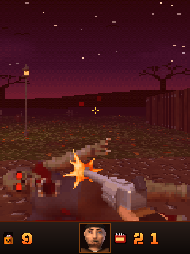<br><sub>“Rest in pieces.”</sub></td>
    <td align="center">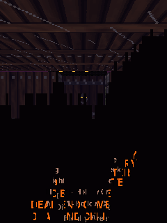<br><sub>Doom-style screen melt</sub></td>
    <td align="center">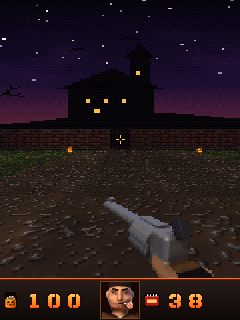<br><sub>Night 2: Blackwood Manor</sub></td>
  </tr>
  <tr>
    <td align="center">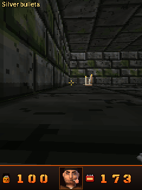<br><sub>Night 3: The Bone Catacombs</sub></td>
    <td align="center">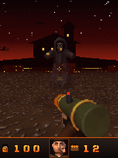<br><sub>Wraith in the blood-moon arena</sub></td>
    <td align="center">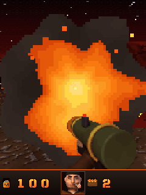<br><sub>Pumpkin Launcher</sub></td>
  </tr>
  <tr>
    <td align="center">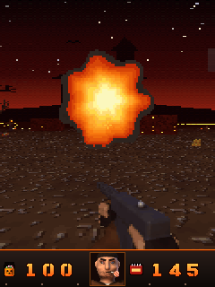<br><sub>Boss fireball volley</sub></td>
    <td align="center"><br><sub>The Pumpkin King</sub></td>
    <td align="center">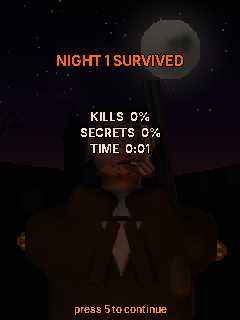<br><sub>Night survived</sub></td>
  </tr>
</table>

## Files

| File | What it is |
|---|---|
| `dist/ButchGraves3D.jar` + `.jad` | Full game (~500 KB): music, sound effects and Butch's voice lines |
| `dist/ButchGraves3D_lite.jar` + `.jad` | Same game without voice lines (~350 KB), for phones with JAR size limits |

Install the `.jar` alone, or the `.jar` + `.jad` pair. Works in J2ME Loader, KEmulator and FreeJ2ME too.

## Controls

| Key | Action |
|---|---|
| 2 / Up | walk forward |
| 8 / Down | walk back |
| 4 6 / Left Right | turn (speeds up while held) |
| 1 3 | strafe |
| 5 / Fire | shoot (hold for auto-fire) |
| 0 | use / open (doors also open when you walk into them) |
| 7 9 | previous / next weapon |
| # | jump |
| * | automap |
| Left or right soft key | pause menu |

## The game

- **4 nights**: Dead End Cemetery, Blackwood Manor, The Bone Catacombs, and the Pumpkin King's Patch (boss fight under a blood moon).
- **Weapons**: Shovel, Silver .44 revolver, Boomstick (double barrel), Tommy Gun, Pumpkin Launcher (explosive jack-o'-lanterns).
- **Monsters**: Ghouls, Pumpkin Scarecrows (fireballs), Wraiths (translucent), Witches (green bolts), and the Pumpkin King (fire volleys, summons minions).
- Skull keys (red, blue, gold), secret doors, explosive powder kegs, health candy, Witch's Brew (+100), bone armor.
- Butch's face in the HUD reacts to damage and grins when he kills or finds a gun.
- Difficulty: Trick (easy), Treat (normal), Nightmare (hard). Progress is saved at the start of every night ("Continue").

### Cheats (classic style)
- On the **difficulty screen**: `#` warps to night 2/3/4 (with all weapons), `0` toggles god mode.
- On the **automap**: press `0` three times to skip the current night.

### Options
Detail (High / Medium / Low), music, sound effects, voice, vibration, crosshair, FPS counter.
**Medium** halves the horizontal resolution, **Low** halves both: use Low on slow phones.

## Using your own music, sounds and voices

All audio is looked up through **`/snd/sounds.txt` inside the JAR**. To swap sounds:

1. Open the `.jar` with 7-Zip or WinRAR (it's a ZIP file).
2. Drop your files in (any folder, e.g. `snd/`).
3. Edit `snd/sounds.txt` and point the keys at your files, e.g.
   `music.level1 = /snd/my_metal_song.mid` or `voice.kill1 = /snd/my_line.wav`.
4. Leave a value empty (`voice.kill1 =`) to silence that sound.
5. If you install with the `.jad`, update its `MIDlet-Jar-Size:` to the new JAR size (or install the `.jar` alone).

The file type comes from the extension: `.mid`, `.wav`, `.amr`, `.mp3`, `.aac` (whatever your phone supports).
Tip: 8 kHz mono WAV works almost everywhere; AMR is ~5x smaller for voice if your phone plays it.

Keys: `music.title, music.story, music.level1..level4, music.win, music.dead`, 25 `sfx.*` keys and 20 `voice.*` keys
(all listed in the file).

## How it works (the tech)

- **Renderer** (`src/E.java`): fixed-point DDA raycaster (no floats, CLDC 1.0 safe) with Wolfenstein-style sliding doors,
  per-cell textured floors and ceilings (row casting), a 360° panoramic sky, distance fog and a Doom-style 32-level colormap,
  per-cell lighting baked from jack-o'-lanterns/candles/lamps with flicker, lightning flashes, muzzle and explosion lights,
  palette flashes for damage and pickups, z-buffered billboard sprites (with 50% translucency for ghosts), particles,
  a Doom-style screen melt, and a strip-based upscaler for the low detail modes.
- **Art**: every monster, weapon and prop was modelled as signed-distance-field geometry and ray-marched in Python
  (`tools/sdf.py`, `monsters.py`, `props.py`, `weapons.py`, `hero.py`), like Doom's photographed clay models. Textures and
  skies are procedural (`tools/textures.py`). Everything shares one 256-colour palette: 223 shaded colours plus
  31 "fullbright" colours (glowing eyes, fire, stained glass) that stay bright in the dark.
- **Audio**: original General-MIDI soundtrack composed in code (`tools/gen_audio.py`); the title theme opens with
  Bach's Toccata in D minor (public domain). Sound effects are synthesized; Butch's voice is espeak-ng with the MBROLA
  US male voice, deepened and roughed up with ffmpeg.
  The sound engine runs on a background worker with a watchdog: it always silences the WAV effects before
  stopping or switching the MIDI music (doing it the other way round deadlocks the audio on many phones),
  drops late effects instead of queueing them, and replaces a worker that hangs inside the phone's audio API.
  `test/snd/run.sh` checks this against a fake MMAPI that models those phone failures.
- **Levels** (`tools/gen_levels.py`): built in code, validated (enclosure, door orientation, key/exit reachability).

## Building

Requirements: JDK 8 (javac with `-source 1.3 -target 1.3`), a MIDP 2.0 / CLDC 1.0 API jar, ProGuard (for preverification).

```
./build.sh            # full version  -> dist/ButchGraves3D.jar/.jad
LITE=1 ./build.sh     # no voices     -> dist/ButchGraves3D_lite.jar/.jad
```
Edit the `TC=` paths at the top of `build.sh`. In NetBeans (Java ME), create a MIDP 2.0 / CLDC 1.0 project,
copy `src/` and `res/` in, and set the MIDlet class to `BG`.

Regenerating assets (Python 3 + numpy + Pillow; espeak-ng + mbrola-us2/us3 + ffmpeg for voices):
```
cd tools
python3 gen_sprites.py     # SDF renders -> tools/spr (takes a few minutes)
python3 gen_hero.py        # Butch's faces and title bust
python3 gen_pack.py        # palette, textures, sprites -> res/d.bin + src/Res.java + HUD/title PNGs
python3 gen_levels.py      # res/l1..l4.bin (+ map previews in tools/out)
python3 gen_audio.py       # res/snd/*
```

## Credits & licences

Code, art, music, sound and story: original, made for this project.
Fonts used only to draw the logo and HUD digits: Creepster, Nosifer and Black Ops One (SIL Open Font License).
Title theme opening: J. S. Bach, Toccata and Fugue in D minor, BWV 565 (public domain).
